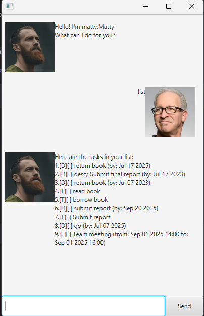

# Matty User Guide



Matty is a task management chatbot that helps you keep track of your **Todos, Deadlines, and Events** efficiently. You can add, update, mark/unmark, delete, and list tasks directly through simple text commands.

## Adding deadlines
You can add a **Deadline** task to track tasks that must be completed by a specific date.

Example: `deadline submit report /by 2025-09-20`

Output:

```
Got it. I've added this task:
[D][ ] submit report (by: Sep 20 2025)
Now you have 1 task in the list.

```

## Adding todos
**Todos** are tasks without a specific due date 

Example: `todo read book report`

Output:

```
Got it. I've added this task:
[T][ ] read book
Now you have 2 tasks in the list.
```

## Adding events
**Events** have a start and end time, useful for scheduling meetings or appointments

Example: `event team meeting /from 2025-09-20 10:00 /to 2025-09-20 12:00`

Output:

```
Got it. I've added this task:
[E][ ] team meeting (from: Sep 20 2025 10:00 to: Sep 20 2025 12:00)
Now you have 3 tasks in the list.
```

## Marking Tasks as Done
You can mark a task as completed

Example: `mark 2`

Output:

```
Nice! I've marked this task as done:
[X] read book
```

## Unmarking Tasks
You can revert a task back to not done.

Example: `unmark 2`

Output:

```
OK, I've marked this task as not done yet:
[ ] read book
```

## Updating Tasks
You can update the description, deadline, or event times without deleting the task.

Example: `update 3 /desc team meeting /from 2025-09-21 09:00 /to 2025-09-21 11:00`

Output:
```
Got it. I've updated the event:
[E][ ] team meeting (from: Sep 21 2025 09:00 to: Sep 21 2025 11:00)
```

## Deleting Tasks
Remove tasks from your list.

Example: `delete 1`

Output:
```
Noted. I've removed this task:
[T][ ] read book
Now you have 2 tasks in the list.
```
## Listing Tasks
Show all tasks in your list.

Example: `list`

Output: 
```
Here are the tasks in your list:
1.[D][ ] submit report (by: Sep 20 2025)
2.[E][ ] team meeting (from: Sep 21 2025 09:00 to: Sep 21 2025 11:00)
```
## Exiting Tasks
Close the chatbot session

Example: `bye`

Output:
```
Bye! Hope to see you again soon!
```